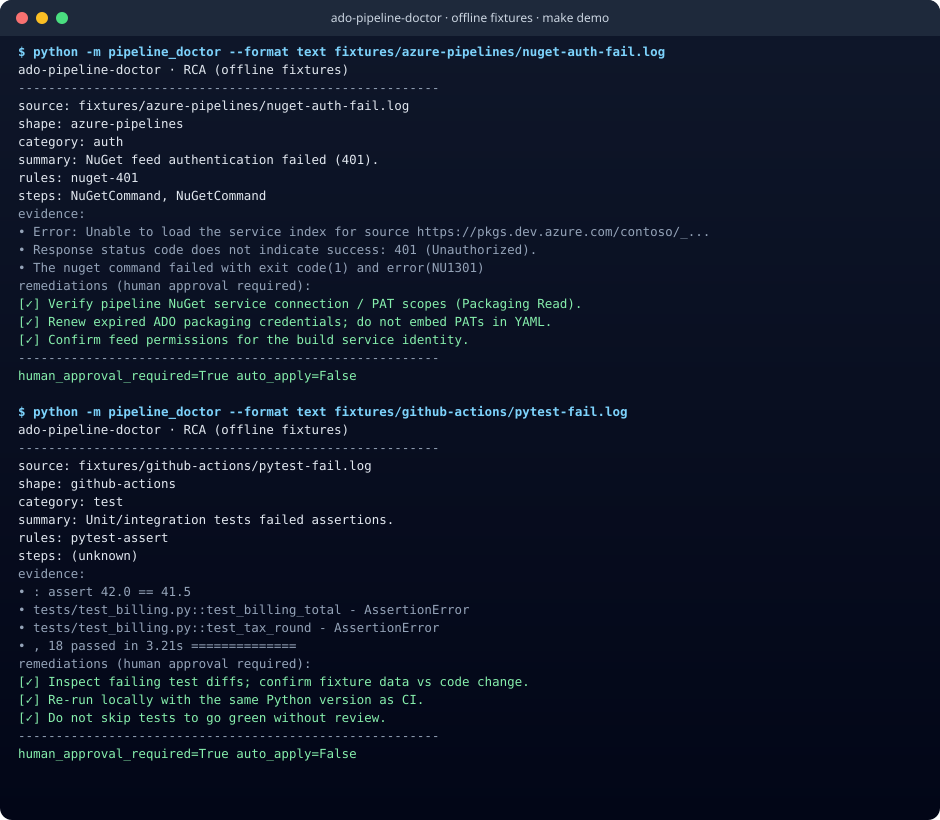
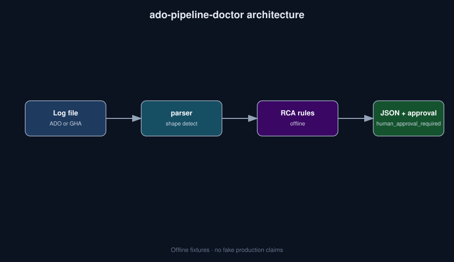

# ado-pipeline-doctor


[](docs/ci/demo.yml)

**Failed Azure Pipelines / GitHub Actions logs → structured RCA JSON. Remediations always require human approval.**

> Who it's for: DevOps / platform SAs who triage ADO and GHA failures daily.

## 30-second demo



```bash
python -m venv .venv && source .venv/bin/activate
pip install -e .
python -m pipeline_doctor --format text fixtures/azure-pipelines/nuget-auth-fail.log
python -m pipeline_doctor --format text fixtures/github-actions/pytest-fail.log
make demo
```

Regenerate SVG: `make demo-assets`. Loom script + LinkedIn caption: [`docs/DEMO.md`](./docs/DEMO.md).

## Why this exists

Red builds burn SA time. This doctor turns fixture (or real) failure logs into **root-cause hypotheses + remediations** with an explicit `human_approval_required: true` flag — safe to wire into an agent skill without auto-patching production YAML.

## Install

```bash
python -m venv .venv && source .venv/bin/activate
pip install -e .
```

Or with pipx (once published to PyPI): `pipx install ado-pipeline-doctor` — until then use editable install from this repo.

## What it is NOT

- Not an auto-healer that edits pipelines without approval
- Not a replacement for App Insights / proper incident process
- Not a hosted SaaS — offline CLI + skill docs
- No fabricated production-usage claims — fixtures only

## Architecture



## Roadmap

- [ ] More rule packs (npm cache, NuGet, service connections, OIDC)
- [ ] Optional LLM explain layer behind the same JSON schema
- [ ] ADO REST adapter (read-only) behind a feature flag

## Contributing

See [CONTRIBUTING.md](./CONTRIBUTING.md). Be kind — [CODE_OF_CONDUCT.md](./CODE_OF_CONDUCT.md). Security reports: [SECURITY.md](./SECURITY.md).

## License

MIT
